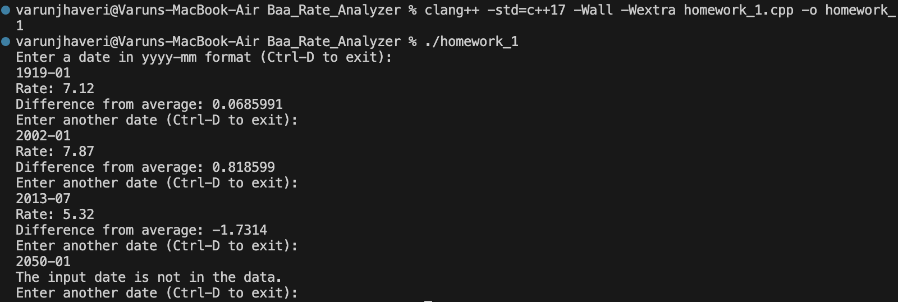

# ISYE 6767 — Homework 1 Report

## Baa Rate Analyzer

### Objective

The objective of this assignment was to implement a C++ program that reads historical Baa corporate bond rate data from the provided `hw1_H.15_Baa_Data.csv` file and allows the user to query the rate associated with a particular month.

The program accepts dates in `yyyy-mm` format. For a valid date, it returns the corresponding Baa rate and the difference between that rate and the average Baa rate across the complete dataset.

If the requested date is not present in the data, the program displays an informative message rather than terminating or crashing.

The provided data file is treated as read-only input and was not manually modified.

---

## Implementation

The program is implemented in `homework_1.cpp` using standard C++17 libraries.

Historical dates and rates are stored in two parallel vectors:

```cpp
vector<string> date;
vector<double> rate;
```

The CSV file is opened using an `ifstream`.

Because the supplied data file contains metadata and header rows before the observations, the program reads through the file until it encounters the `Time Period` header. The remaining rows are then parsed as historical observations.

Each data row follows the structure:

```text
yyyy-mm,rate
```

The date is stored in the `date` vector, while the corresponding rate is converted from a string to a `double` and stored in the `rate` vector.

Because the two vectors are parallel, the date and rate at a particular index correspond to the same observation.

---

## Functions

### `average`

```cpp
double average(vector<double> v)
```

The `average` function calculates the arithmetic mean of all rates contained in the supplied vector.

The function first checks whether the vector is empty. If values are present, it:

1. Initializes a running total.
2. Iterates through every value in the vector.
3. Adds each value to the total.
4. Divides the total by the number of observations.
5. Returns the resulting average as a `double`.

---

### `find_rate`

```cpp
double find_rate(
    vector<double> rate_vec,
    vector<string> date_vec,
    string date
)
```

The `find_rate` function searches the date vector for a user-supplied date.

When a matching date is found, the corresponding rate is returned from the same index of the rate vector.

Conceptually:

```text
date_vec[i]  -> date
rate_vec[i]  -> corresponding Baa rate
```

If the requested date does not appear in the dataset, the function returns `-1.0`.

Because the historical rates in the dataset are positive, this value can be used as a sentinel indicating that a matching date was not found.

---

## File Parsing

The program reads:

```text
hw1_H.15_Baa_Data.csv
```

using a C++ input file stream.

The original CSV contains metadata before the historical observations. Instead of manually deleting these rows, the program handles them during parsing.

The program reads lines until it finds the data header containing:

```text
Time Period
```

It then processes each remaining row by locating the comma separating the date and rate.

The date portion is stored as a string, while the rate portion is converted to a `double` using `stod()`.

Malformed or empty lines are ignored rather than causing the program to terminate.

---

## User Interaction

After the data has been loaded, the program calculates the historical average rate and prompts the user to enter a date:

```text
Enter a date in yyyy-mm format (Ctrl-D to exit):
```

For a valid date, the program displays:

```text
Rate: <rate>
Difference from average: <difference>
```

The difference is calculated as:

```text
requested rate - historical average rate
```

For a date that does not exist in the dataset, the program displays:

```text
The input date is not in the data.
```

The program continues accepting dates until the user sends an EOF signal.

On macOS and Linux, EOF is entered using:

```text
Ctrl-D
```

---

## Error Handling

The program includes checks for several possible problems:

* The CSV file cannot be opened.
* The CSV contains empty or malformed rows.
* No valid observations are loaded.
* The user requests a date that does not appear in the dataset.
* The vector supplied to `average` is empty.

An invalid date query does not terminate the program. The user can continue entering additional dates.

---

## Testing

A unit-test function is included in the source code to test the main computational functions.

The tests verify:

* calculation of a known arithmetic average,
* retrieval of the expected rate for a valid test date,
* correct handling of a date that does not exist.

The complete program was also tested manually from the terminal using both valid and invalid dates.

The program was compiled using:

```bash
clang++ -std=c++17 -Wall -Wextra homework_1.cpp -o homework_1
```

and executed using:

```bash
./homework_1
```

The program compiled and ran successfully from the terminal.

---

## Results

The completed implementation successfully:

* Loads the supplied Baa rate dataset.
* Handles the metadata and CSV headers programmatically.
* Leaves the original supplied data unchanged.
* Calculates the average Baa rate.
* Returns the correct rate for a valid date.
* Calculates the difference between the queried rate and the historical average.
* Handles unavailable dates without crashing.
* Supports repeated user queries.
* Terminates correctly when an EOF signal is supplied.

---

## Program Execution

The following screenshot shows the C++ program being compiled and executed from the terminal using sample date queries.



---

## Conclusion

The completed Baa Rate Analyzer satisfies the required functionality for Homework 1. The program reads the supplied historical data directly from the CSV file, calculates the dataset average, supports repeated date-based rate queries, reports the difference between an individual observation and the historical average, and safely handles dates that are not present in the dataset.
