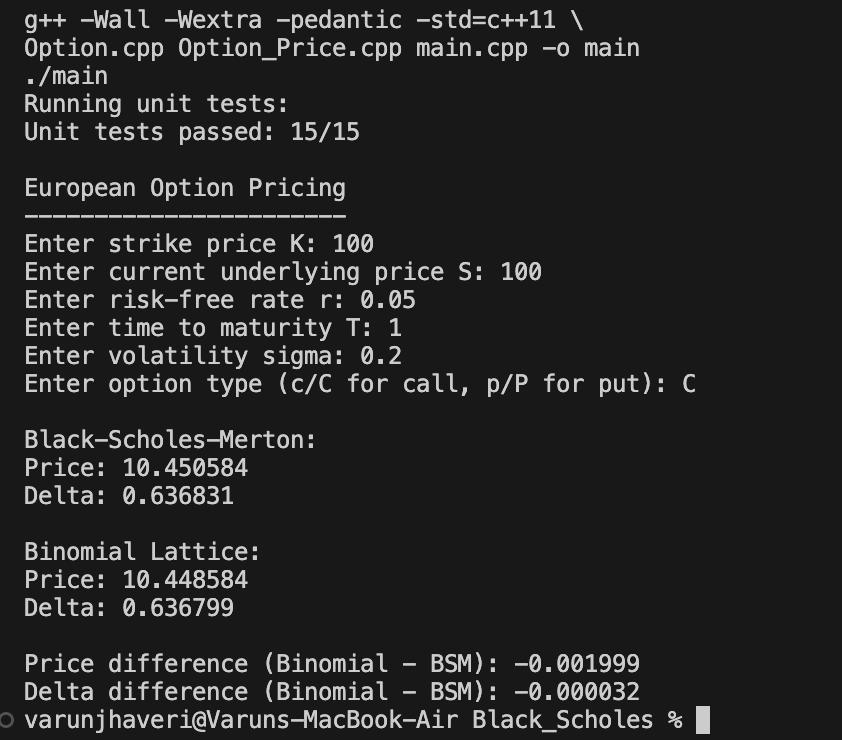

# ISyE 6767 — Homework 3 Report

## European Option Pricing Using Black-Scholes-Merton and Binomial Lattice Models

### Objective

The objective of this homework was to design an object-oriented C++ program for pricing European call and put options using two methods:

- the Black-Scholes-Merton analytical pricing model,
- the binomial lattice pricing model.

Both methods compute the option price and the corresponding Delta. The option is defined using strike price \(K\), current underlying price \(S\), risk-free rate \(r\), time to maturity \(T\), volatility \(\sigma\), and a call/put flag.

---

## Program Design

The implementation is divided into three main classes.

### `Option`

The `Option` class stores the five option parameters:

\[
K,\quad S,\quad r,\quad T,\quad \sigma.
\]

The class includes:

- a private `init()` function,
- a default constructor,
- a parameterized constructor,
- a destructor,
- getter methods for all five parameters.

The default constructor calls `init()` and initializes the parameters to zero.

### `Pricing_Method`

`Pricing_Method` is implemented as an abstract class.

It declares the two pure virtual pricing functions:

```cpp
BSM_Pricer()
Binomial_Pricer()
```

Both functions return a `PricingResult` containing:

```text
price
delta
```

### `Option_Price`

`Option_Price` inherits from both `Option` and `Pricing_Method`.

It contains the public option-type flag:

```text
c / C = call
p / P = put
```

The class implements both required pricing methods and obtains the pricing parameters through the getter functions inherited from `Option`.

---

## Black-Scholes-Merton Pricing

The Black-Scholes-Merton implementation first calculates

\[
d_1=
\frac{
\ln(S/K)+(r+\frac{1}{2}\sigma^2)T
}{
\sigma\sqrt{T}
}
\]

and

\[
d_2=d_1-\sigma\sqrt{T}.
\]

For a European call option, the price is

\[
C
=
S N(d_1)
-
K e^{-rT} N(d_2),
\]

with Delta

\[
\Delta_C=N(d_1).
\]

For a European put option,

\[
P
=
K e^{-rT}N(-d_2)
-
S N(-d_1),
\]

with Delta

\[
\Delta_P=N(d_1)-1.
\]

---

## Binomial Lattice Pricing

The binomial implementation uses a Cox-Ross-Rubinstein lattice with 1000 time steps.

For each time step,

\[
\Delta t=\frac{T}{N},
\]

and the up and down factors are

\[
u=e^{\sigma\sqrt{\Delta t}},
\qquad
d=\frac{1}{u}.
\]

The risk-neutral probability is

\[
p=
\frac{e^{r\Delta t}-d}
{u-d}.
\]

At maturity, the terminal payoff is calculated as

\[
\max(S_T-K,0)
\]

for a call and

\[
\max(K-S_T,0)
\]

for a put.

Backward induction is then used to calculate the present option value.

The binomial Delta is calculated from the first-step up and down nodes:

\[
\Delta=
\frac{V_u-V_d}
{S_u-S_d}.
\]

---

## Unit Testing

A separate `test.h` file contains unit tests covering:

1. Black-Scholes call price.
2. Black-Scholes call Delta.
3. Black-Scholes put price.
4. Black-Scholes put Delta.
5. Uppercase call flag.
6. Uppercase put flag.
7. Binomial call consistency with Black-Scholes.
8. Binomial put consistency with Black-Scholes.
9. Put-call parity.
10. Invalid option flag.
11. Invalid volatility.
12. Invalid time to maturity.
13. Default constructor initialization.
14. Parameterized constructor, getter functions, and option flag.
15. Invalid flag handling in the binomial model.

All tests passed successfully:

```text
Unit tests passed: 15/15
```

---

## Numerical Results

The program was tested using the following option parameters:

| Parameter | Value |
|---|---:|
| Current underlying price \(S\) | 100 |
| Strike price \(K\) | 100 |
| Risk-free rate \(r\) | 0.05 |
| Time to maturity \(T\) | 1 |
| Volatility \(\sigma\) | 0.20 |
| Option type | Call |

The resulting prices and Deltas were:

| Method | Price | Delta |
|---|---:|---:|
| Black-Scholes-Merton | 10.450584 | 0.636831 |
| Binomial Lattice | 10.448584 | 0.636799 |

The differences were:

```text
Price difference (Binomial - BSM): -0.001999
Delta difference (Binomial - BSM): -0.000032
```

---

## Comparison of the Two Methods

The two methods produce extremely similar values.

The absolute price difference is approximately

\[
0.002,
\]

while the Delta difference is approximately

\[
0.000032.
\]

The Black-Scholes-Merton model gives an analytical solution, while the binomial model approximates the option value numerically using a discrete lattice.

With 1000 binomial time steps, the lattice result is very close to the analytical Black-Scholes-Merton result. Therefore, for this test case, the two pricing methods are **consistent with one another**.

---

## Compilation and Execution

The program was compiled using:

```bash
g++ -Wall -Wextra -pedantic -std=c++11 \
Option.cpp Option_Price.cpp main.cpp -o main
```

and executed using:

```bash
./main
```

The program compiled successfully and all 15 unit tests passed.

---

## Program Execution

The following screenshot shows the unit-test results and option-pricing output:



---

## Conclusion

The completed program successfully implements the required object-oriented option-pricing framework.

The `Option` class stores the option parameters, `Pricing_Method` provides the abstract pricing interface, and `Option_Price` implements both the Black-Scholes-Merton and binomial lattice methods.

For the tested European call option, the binomial price and Delta are extremely close to their Black-Scholes-Merton counterparts. This indicates that the numerical binomial lattice implementation is consistent with the analytical Black-Scholes-Merton model for the tested parameters.