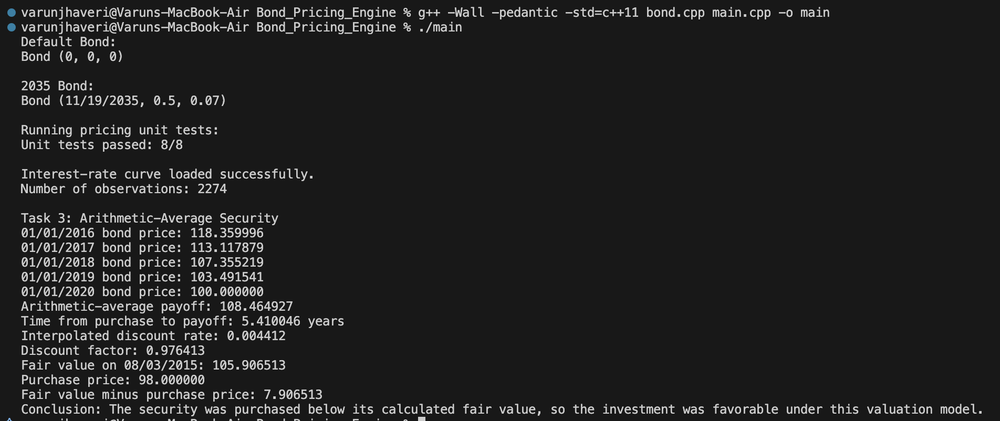

# ISyE 6767 — Homework 2 Report

## Bond Pricing Engine

### Objective

This homework implements a C++ `Bond` class, a general bond-pricing function using a term structure of continuously compounded zero rates, and the valuation of an arithmetic-average exotic security.

The bond-pricing function considers only remaining future cash flows, supports fractional first coupon periods, and discounts each cash flow using

\[
DF(T)=e^{-y(T)T},
\]

where \(y(T)\) is the zero-coupon rate corresponding to maturity \(T\). The assignment also specifies that the bond price at maturity should be treated as its par value. 

---

## Task 1 — Bond Class

The `Bond` class contains private members for:

- expiration date,
- payment frequency,
- coupon rate.

It implements:

- a default constructor,
- destructor,
- copy constructor,
- parameterized constructor,
- `ToString()`.

The program creates both a default bond and a semiannual 7% coupon bond expiring on November 19, 2035.

Example output:

```text
Bond (11/19/2035, 0.5, 0.07)
```

---

## Task 2 — Bond Pricing

The pricing function accepts:

- face value,
- coupon rate,
- payment frequency,
- maturity date,
- valuation date,
- interest-rate term structure.

The function calculates the remaining time to maturity and constructs the future payment schedule.

If the first remaining coupon period is shorter than the regular payment interval, the first coupon is scaled according to the fractional period. All later coupon payments use the regular frequency.

Each cash flow is discounted using the continuously compounded rate obtained from `Bond_Ex3.csv`. Linear interpolation is used when the required maturity does not exactly appear in the supplied term structure.

The final remaining cash flow contains both the last coupon and the face value.

### Unit Testing

Eight unit tests were implemented to verify the pricing engine under
different conditions:

1. Regular semiannual bond with zero interest rates.
2. Fractional first coupon period.
3. Bond valued exactly at maturity.
4. Bond discounted using a non-zero continuously compounded rate.
5. Interest-rate interpolation between two term-structure observations.
6. Bond valued after maturity.
7. Invalid interest-rate curve dimensions.
8. Invalid valuation date.

The result was:

```text
Unit tests passed: 8/8
```

---

## Task 3 — Arithmetic-Average Security

The underlying security is a 10-year bond issued on January 1, 2010 and maturing on January 1, 2020.

Its parameters are:

```text
Face value:       100
Coupon rate:      5%
Payment interval: 0.5 years
```

The bond values on January 1 of each observation year were:

| Date | Bond Price |
|---|---:|
| 01/01/2016 | 118.359996 |
| 01/01/2017 | 113.117879 |
| 01/01/2018 | 107.355219 |
| 01/01/2019 | 103.491541 |
| 01/01/2020 | 100.000000 |

The arithmetic-average payoff is

\[
\frac{
118.359996+
113.117879+
107.355219+
103.491541+
100
}{5}
=
108.464927.
\]

The payoff is made on December 31, 2020 and must therefore be discounted back to the purchase date of August 3, 2015.

The time between the purchase date and payoff date is approximately

\[
T=5.410046 \text{ years}.
\]

Using the supplied term structure, the interpolated continuously compounded zero rate is

\[
y(T)=0.004412.
\]

Therefore, the discount factor is approximately

\[
e^{-0.004412(5.410046)}
=
0.976413.
\]

The fair value of the security on August 3, 2015 is therefore

\[
108.464927(0.976413)
=
105.906513.
\]

The actual purchase price was

\[
98.000000.
\]

Thus,

\[
105.906513-98
=
7.906513.
\]

Under this valuation model, the security was purchased for approximately **$7.91 less than its calculated fair value**, so the investment was favorable.

---

## Compilation and Execution

The program was compiled using:

```bash
g++ -Wall -pedantic -std=c++11 bond.cpp main.cpp -o main
```

and executed using:

```bash
./main
```

The code compiled successfully without warnings, all unit tests passed, and the required valuation results were produced.

## Program Execution

The following screenshot shows the program execution and Task 3 results:



---

## Conclusion

The completed program successfully implements the required `Bond` class, prices bonds using the supplied zero-rate term structure, handles fractional coupon periods, and evaluates the arithmetic-average security. The calculated fair value of approximately **$105.91** exceeds the $98 purchase price, indicating that the security was purchased below its model-implied value.